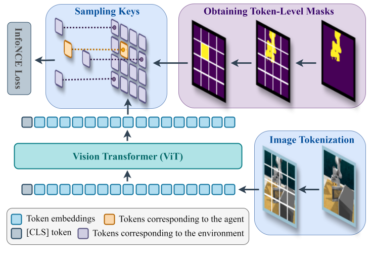

# Inter-token Contrast (ICon)

[[Project Website]]()
[[Paper (Under Review)]]()
[[Data]]()



## 🔧 Installation
We recommend that users first create a Conda environment:
```bash
conda create -n icon_env python=3.10
conda activate icon_env
```
Then, install the Python package:
```
pip install git+https://github.com/HenryWJL/icon.git
```
This will automatically install all dependencies required to reproduce our experimental results in simulation. Note that running the RLBench environment requires **CoppeliaSim** to be installed. If you haven't installed CoppeliaSim yet, please follow the instructions [here](https://github.com/stepjam/RLBench?tab=readme-ov-file#install) to set it up.
 
## 💻 Training
### Downloading a Dataset
We provide a new dataset spanning 8 manipulation tasks across 3 different robots from the RLBench and Robosuite benchmarks. [Here](https://github.com/HenryWJL/icon/tree/main/icon/configs/task) is a complete list of tasks. To download our full dataset:
```bash
python scripts/download_dataset.py
```
If you'd like to download the data for a specific task (e.g., *Close Drawer*):
```bash
python scripts/download_dataset.py -t close_drawer
```
You can also download the dataset directly from the [Hugging Face](https://huggingface.co/datasets/HenryWJL/icon).

### Running on a Device 
Now it’s time to give it a try! You can run `scripts/train.py` to train any algorithm on any task you like.
For example, to train a CNN-based diffusion policy coupled with ICon on the *Open Box* task:
```bash
python scripts/train.py task=open_box algo=icon_diffusion_unet
```
This will automatically create a subdirectory at `outputs/TASK_NAME/ALGO_NAME/YYYY-MM-DD/HH-MM-SS`, where configuration files, log files, and checkpoints will be saved. If you want to run on a different device with a different seed, simply append the desired arguments to the original command:
```bash
python scripts/train.py task=open_box algo=icon_diffusion_unet train.device=cuda:0 train.seed=100
```
To enable Weights & Biases:
```bash
wandb login
python scripts/train.py task=open_box algo=icon_diffusion_unet train.device=cuda:0 train.seed=100 train.wandb.enable=true
```

## ⏳ Evaluation
Once you have obtained a well-trained policy, you can evaluate its performance in the simulated environments. For example, to evaluate a Transformer-based diffusion policy agumented with ICon on the *Close Microwave* task for 50 episodes: 
```bash
python scripts/eval_sim_robot.py -t close_microwave -a icon_diffusion_transformer -c PATH_TO_YOUR_CHECKPOINT -ne 50
```
Videos of all episodes will be recorded and saved in `videos/TASK_NAME/ALGO_NAME`. To visualize the scene during rollout, set the rendering mode to "human":
```bash
python scripts/eval_sim_robot.py -t close_microwave -a icon_diffusion_transformer -c PATH_TO_YOUR_CHECKPOINT -ne 50 -rm human
```
